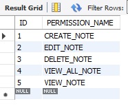
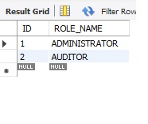
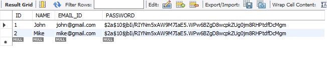
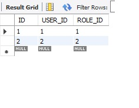

# Spring-Boot-2.1-OAuth2-Authorization-Server-and-Resource-Server-JWT-and-MySQL
### download open ssl desktop app (Win64OpenSSL-1_1_1h.exe) from here and install
https://slproweb.com/products/Win32OpenSSL.html

### use open ssl to generate private and public keys
genrsa -out jwt.pem 2048

### use below command to get private key
rsa -in jwt.pem

### create tables in db as below
SELECT * FROM sridb.permission;

SELECT * FROM sridb.role;

SELECT * FROM sridb.user;

SELECT * FROM sridb.assign_permission_to_role;

SELECT * FROM sridb.assign_user_to_role;

## postman collection is attached